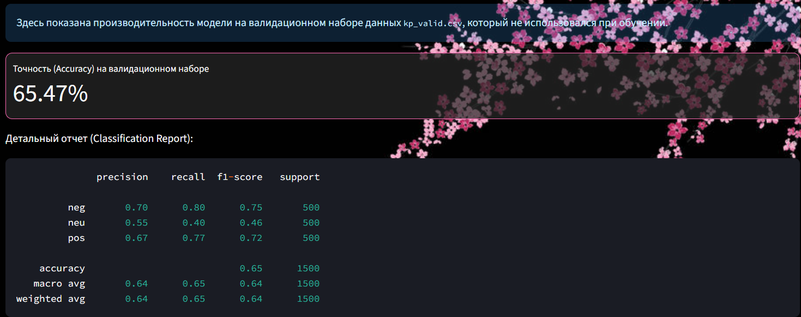

<div align="center">


🌸 Анализ тональности отзывов на фильмы 🌸

Интерактивное веб-приложение на Streamlit для классификации эмоциональной окраски текста с использованием модели LogisticRegression, обученной на отзывах с Кинопоиска.

<p>


</p>

</div>

📜 Оглавление

🌸 О проекте

🎯 Задача

🛠️ Технологии и инструменты

🌌 Этапы работы

Подготовка текста

Векторизация признаков

Обучение модели

📈 Результаты и оценка

✨ Демонстрация

🚀 Как запустить

🌸 О проекте

Этот проект является практической реализацией Лабораторной работы №4 по теме "Предсказание эмоциональной окраски отзыва на основе анализа естественного языка". Исходная теоретическая задача (анализ англоязычного датасета IMDB) была переосмыслена и реализована для работы с русскоязычными данными на примере отзывов с сайта Кинопоиск.

Решение представлено в виде интерактивного веб-приложения на Streamlit с кастомной темой "Ночная сакура". Приложение позволяет не только классифицировать отзывы в реальном времени, но и наглядно оценивать качество предобученной модели на валидационных данных.

<br>
<p align="center">

</p>
<br>

🎯 Задача

Основная цель — разработать и оценить модель классификации для определения тональности отзыва на фильм (позитивный, нейтральный, негативный). Задача основана на методичке lab4.ipynb, но адаптирована для русского языка и обернута в веб-интерфейс.

Ключевая метрика для оценки качества модели — Accuracy, которая показывает долю правильных предсказаний.

🛠️ Технологии и инструменты
Категория	Инструмент
Обработка текста (NLP)	NLTK, Pymorphy3
Анализ данных	Pandas, NumPy, Re
Машинное обучение	Scikit-learn (TF-IDF, Logistic Regression), Joblib
Веб-приложение	Streamlit
Визуализация	Matplotlib, Seaborn

🌌 Этапы работы
1. Подготовка текста и инструментов NLP

🔮 Очистка и лемматизация. Первым шагом является подготовка текста к анализу. Этот процесс включает:

Приведение к нижнему регистру и удаление знаков пунктуации.

Лемматизацию слов с помощью Pymorphy3 для приведения их к нормальной форме.

Удаление стоп-слов с использованием расширенного списка из NLTK, что помогает модели фокусироваться на значащих терминах.

```
# Функция предобработки текста
def preprocess_text(text):
    """Очищает и лемматизирует текст."""
    if not isinstance(text, str):
        return ""
    text = text.lower()
    text = re.sub(r'[^а-яА-ЯёЁ\s]', ' ', text)
    words = text.split()
    lemmatized_words = [morph.parse(word)[0].normal_form for word in words if word not in russian_stopwords]
    return " ".join(lemmatized_words)
 ```
2. Векторизация признаков

✨ Преобразование в векторы. Для преобразования текстовых данных в числовой формат используется TfidfVectorizer. Этот метод учитывает не только частоту слова в документе, но и его важность во всей коллекции текстов. Для захвата более сложных контекстных связей были использованы N-граммы (сочетания из 1 и 2 слов) с оптимальными параметрами min_df и max_df.

3. Обучение модели

🤖 Выбор и тренировка классификатора. Вместо LinearSVC из теоретической части была выбрана Логистическая регрессия (LogisticRegression) как более эффективная для данной задачи. Модель обучается на предобработанных и векторизованных данных с использованием сбалансированных весов классов (class_weight='balanced'), что особенно важно при работе с несбалансированными наборами данных.

📈 Результаты и оценка

Приложение содержит вкладку "Оценка модели", где в реальном времени рассчитываются ключевые метрики на валидационном наборе данных kp_valid.csv:

Accuracy Score: Общая точность модели.

Classification Report: Детальный отчет с точностью, полнотой и F1-мерой для каждого класса.

Confusion Matrix: Наглядная матрица ошибок, которая показывает, какие классы модель путает чаще всего.

<p align="center">

<i><br>Интерфейс для оценки качества модели по метрикам Accuracy, Precision, Recall и F1-score.</i>
</p>

✨ Демонстрация

Главная особенность приложения — интерактивный раздел для прогнозирования тональности. Пользователь может ввести любой текст отзыва в текстовое поле, и модель мгновенно определит его эмоциональную окраску, выводя результат в интуитивно понятном виде.

<div align="center">

<p><i><br>Интерфейс приложения для прогнозирования тональности отзыва.</i></p>
</div>

🚀 Как запустить

1. Клонируйте репозиторий:

```
git clone https://github.com/your-username/your-repo-name.git
cd your-repo-name
```
2. Установите зависимости:

```
pip install -r requirements.txt
```
(Примечание: Убедитесь, что у вас создан файл requirements.txt со всеми необходимыми библиотеками)

3. Обучите модель:
Перед первым запуском приложения необходимо обучить модель и создать файлы векторизатора и классификатора. Запустите скрипт:

```
python train_model.py
```
В результате в папке проекта появятся файлы linear_svc_model.joblib и tfidf_vectorizer.joblib.

4. Запустите веб-приложение Streamlit:

```
streamlit run sentiment_app.py
```
После выполнения команды в вашем браузере откроется интерактивное веб-приложение.